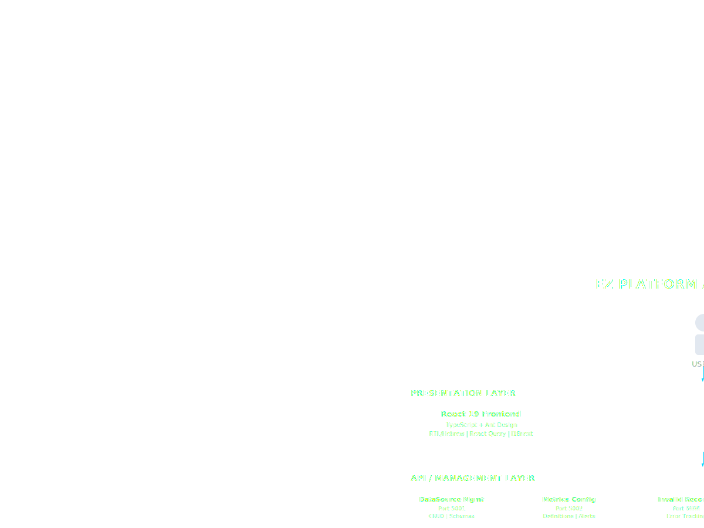

# EZ Platform Architecture
_Data Processing & Validation Platform | 9 Microservices | Event-Driven_

---

## Architecture Diagram (Embedded)

<svg viewbox="0 0 1200 900" xmlns="http://www.w3.org/2000/svg">
<defs>
<lineargradient id="headerGrad" x1="0%" x2="100%" y1="0%" y2="0%">
<stop offset="0%" style="stop-color:#7c3aed"></stop>
<stop offset="100%" style="stop-color:#00d4ff"></stop>
</lineargradient>
<lineargradient id="presentationGrad" x1="0%" x2="0%" y1="0%" y2="100%">
<stop offset="0%" style="stop-color:#3b82f6"></stop>
<stop offset="100%" style="stop-color:#1d4ed8"></stop>
</lineargradient>
<lineargradient id="apiGrad" x1="0%" x2="0%" y1="0%" y2="100%">
<stop offset="0%" style="stop-color:#10b981"></stop>
<stop offset="100%" style="stop-color:#059669"></stop>
</lineargradient>
<lineargradient id="pipelineGrad" x1="0%" x2="0%" y1="0%" y2="100%">
<stop offset="0%" style="stop-color:#f59e0b"></stop>
<stop offset="100%" style="stop-color:#d97706"></stop>
</lineargradient>
<lineargradient id="infraGrad" x1="0%" x2="0%" y1="0%" y2="100%">
<stop offset="0%" style="stop-color:#8b5cf6"></stop>
<stop offset="100%" style="stop-color:#6d28d9"></stop>
</lineargradient>
<lineargradient id="observabilityGrad" x1="0%" x2="0%" y1="0%" y2="100%">
<stop offset="0%" style="stop-color:#ec4899"></stop>
<stop offset="100%" style="stop-color:#be185d"></stop>
</lineargradient>
<filter height="140%" id="shadow" width="140%" x="-20%" y="-20%">
<fedropshadow dx="0" dy="4" flood-opacity="0.3" stddeviation="8"></fedropshadow>
</filter>
<marker id="arrowhead" markerheight="7" markerwidth="10" orient="auto" refx="9" refy="3.5">
<polygon fill="#00d4ff" points="0 0, 10 3.5, 0 7"></polygon>
</marker>
</defs>
<!-- Title Banner -->
<rect fill="url(#headerGrad)" filter="url(#shadow)" height="50" rx="8" width="1100" x="50" y="10"></rect>
<text fill="white" font-size="22" font-weight="bold" text-anchor="middle" x="600" y="42">EZ PLATFORM ARCHITECTURE</text>
<!-- Users -->
<g transform="translate(550, 80)">
<circle cx="50" cy="20" fill="#e2e8f0" r="15"></circle>
<rect fill="#e2e8f0" height="35" rx="5" width="30" x="35" y="40"></rect>
<text fill="#a0aec0" font-size="12" text-anchor="middle" x="50" y="95">USERS</text>
</g>
<!-- Arrow from Users to Presentation -->
<line marker-end="url(#arrowhead)" stroke="#00d4ff" stroke-width="2" x1="600" x2="600" y1="175" y2="195"></line>
<!-- PRESENTATION LAYER -->
<rect fill="url(#presentationGrad)" filter="url(#shadow)" height="120" opacity="0.9" rx="12" width="1100" x="50" y="200"></rect>
<text fill="white" font-size="14" font-weight="bold" x="100" y="225">PRESENTATION LAYER</text>
<!-- React Frontend Box -->
<rect fill="rgba(255,255,255,0.15)" height="65" rx="8" stroke="rgba(255,255,255,0.3)" stroke-width="1" width="280" x="80" y="240"></rect>
<text fill="white" font-size="13" font-weight="bold" text-anchor="middle" x="220" y="260">React 19 Frontend</text>
<text fill="rgba(255,255,255,0.8)" font-size="10" text-anchor="middle" x="220" y="278">TypeScript + Ant Design</text>
<text fill="rgba(255,255,255,0.8)" font-size="10" text-anchor="middle" x="220" y="293">RTL/Hebrew | React Query | i18next</text>
<!-- Nginx Ingress Box -->
<rect fill="rgba(255,255,255,0.15)" height="65" rx="8" stroke="rgba(255,255,255,0.3)" stroke-width="1" width="280" x="840" y="240"></rect>
<text fill="white" font-size="13" font-weight="bold" text-anchor="middle" x="980" y="260">NGINX Ingress</text>
<text fill="rgba(255,255,255,0.8)" font-size="10" text-anchor="middle" x="980" y="278">Path-based Routing</text>
<text fill="rgba(255,255,255,0.8)" font-size="10" text-anchor="middle" x="980" y="293">ezplatform.local | CORS enabled</text>
<!-- Arrow from Presentation to API -->
<line marker-end="url(#arrowhead)" stroke="#00d4ff" stroke-width="2" x1="600" x2="600" y1="320" y2="340"></line>
<text fill="#a0aec0" font-size="10" x="620" y="335">REST APIs</text>
<!-- API / MANAGEMENT LAYER -->
<rect fill="url(#apiGrad)" filter="url(#shadow)" height="110" opacity="0.9" rx="12" width="1100" x="50" y="345"></rect>
<text fill="white" font-size="14" font-weight="bold" x="100" y="370">API / MANAGEMENT LAYER</text>
<!-- Service boxes in API layer -->
<rect fill="rgba(255,255,255,0.15)" height="55" rx="6" stroke="rgba(255,255,255,0.3)" width="180" x="80" y="385"></rect>
<text fill="white" font-size="11" font-weight="bold" text-anchor="middle" x="170" y="405">DataSource Mgmt</text>
<text fill="rgba(255,255,255,0.7)" font-size="9" text-anchor="middle" x="170" y="420">Port 5001</text>
<text fill="rgba(255,255,255,0.7)" font-size="9" text-anchor="middle" x="170" y="433">CRUD | Schemas</text>
<rect fill="rgba(255,255,255,0.15)" height="55" rx="6" stroke="rgba(255,255,255,0.3)" width="180" x="280" y="385"></rect>
<text fill="white" font-size="11" font-weight="bold" text-anchor="middle" x="370" y="405">Metrics Config</text>
<text fill="rgba(255,255,255,0.7)" font-size="9" text-anchor="middle" x="370" y="420">Port 5002</text>
<text fill="rgba(255,255,255,0.7)" font-size="9" text-anchor="middle" x="370" y="433">Definitions | Alerts</text>
<rect fill="rgba(255,255,255,0.15)" height="55" rx="6" stroke="rgba(255,255,255,0.3)" width="180" x="480" y="385"></rect>
<text fill="white" font-size="11" font-weight="bold" text-anchor="middle" x="570" y="405">Invalid Records</text>
<text fill="rgba(255,255,255,0.7)" font-size="9" text-anchor="middle" x="570" y="420">Port 5006</text>
<text fill="rgba(255,255,255,0.7)" font-size="9" text-anchor="middle" x="570" y="433">Error Tracking</text>
<rect fill="rgba(255,255,255,0.15)" height="55" rx="6" stroke="rgba(255,255,255,0.3)" width="180" x="680" y="385"></rect>
<text fill="white" font-size="11" font-weight="bold" text-anchor="middle" x="770" y="405">Scheduling</text>
<text fill="rgba(255,255,255,0.7)" font-size="9" text-anchor="middle" x="770" y="420">Port 5004</text>
<text fill="rgba(255,255,255,0.7)" font-size="9" text-anchor="middle" x="770" y="433">Quartz.NET | Cron</text>
<!-- Arrow from API to Pipeline -->
<line marker-end="url(#arrowhead)" stroke="#00d4ff" stroke-width="2" x1="600" x2="600" y1="455" y2="475"></line>
<text fill="#a0aec0" font-size="10" x="620" y="470">MassTransit on RabbitMQ</text>
<!-- DATA PROCESSING PIPELINE -->
<rect fill="url(#pipelineGrad)" filter="url(#shadow)" height="140" opacity="0.9" rx="12" width="1100" x="50" y="480"></rect>
<text fill="white" font-size="14" font-weight="bold" x="100" y="505">DATA PROCESSING PIPELINE</text>
<!-- Pipeline services -->
<rect fill="rgba(255,255,255,0.15)" height="85" rx="6" stroke="rgba(255,255,255,0.3)" width="160" x="80" y="520"></rect>
<text fill="white" font-size="11" font-weight="bold" text-anchor="middle" x="160" y="540">File Discovery</text>
<text fill="rgba(255,255,255,0.7)" font-size="9" text-anchor="middle" x="160" y="555">Port 5007 | 2 replicas</text>
<text fill="rgba(255,255,255,0.7)" font-size="9" text-anchor="middle" x="160" y="570">Poll folders</text>
<text fill="rgba(255,255,255,0.7)" font-size="9" text-anchor="middle" x="160" y="585">Deduplication</text>
<text fill="rgba(255,255,255,0.7)" font-size="9" text-anchor="middle" x="160" y="598">(file hashes)</text>
<!-- Arrow -->
<line marker-end="url(#arrowhead)" stroke="white" stroke-width="2" x1="250" x2="305" y1="560" y2="560"></line>
<rect fill="rgba(255,255,255,0.15)" height="85" rx="6" stroke="rgba(255,255,255,0.3)" width="160" x="315" y="520"></rect>
<text fill="white" font-size="11" font-weight="bold" text-anchor="middle" x="395" y="540">File Processor</text>
<text fill="rgba(255,255,255,0.7)" font-size="9" text-anchor="middle" x="395" y="555">Port 5008 | 2 replicas</text>
<text fill="rgba(255,255,255,0.7)" font-size="9" text-anchor="middle" x="395" y="570">Format Detection</text>
<text fill="rgba(255,255,255,0.7)" font-size="9" text-anchor="middle" x="395" y="585">CSV/XML/Excel</text>
<text fill="rgba(255,255,255,0.7)" font-size="9" text-anchor="middle" x="395" y="598">→ JSON</text>
<!-- Arrow -->
<line marker-end="url(#arrowhead)" stroke="white" stroke-width="2" x1="485" x2="540" y1="560" y2="560"></line>
<rect fill="rgba(255,255,255,0.15)" height="85" rx="6" stroke="rgba(255,255,255,0.3)" width="160" x="550" y="520"></rect>
<text fill="white" font-size="11" font-weight="bold" text-anchor="middle" x="630" y="540">Validation</text>
<text fill="rgba(255,255,255,0.7)" font-size="9" text-anchor="middle" x="630" y="555">Port 5003 | 1 replica</text>
<text fill="rgba(255,255,255,0.7)" font-size="9" text-anchor="middle" x="630" y="570">JSON Schema 2020-12</text>
<text fill="rgba(255,255,255,0.7)" font-size="9" text-anchor="middle" x="630" y="585">Business Rules</text>
<text fill="rgba(255,255,255,0.7)" font-size="9" text-anchor="middle" x="630" y="598">Metrics Calc</text>
<!-- Arrow -->
<line marker-end="url(#arrowhead)" stroke="white" stroke-width="2" x1="720" x2="775" y1="560" y2="560"></line>
<rect fill="rgba(255,255,255,0.15)" height="85" rx="6" stroke="rgba(255,255,255,0.3)" width="160" x="785" y="520"></rect>
<text fill="white" font-size="11" font-weight="bold" text-anchor="middle" x="865" y="540">Output</text>
<text fill="rgba(255,255,255,0.7)" font-size="9" text-anchor="middle" x="865" y="555">Port 5009 | 3 replicas</text>
<text fill="rgba(255,255,255,0.7)" font-size="9" text-anchor="middle" x="865" y="570">Local | SFTP</text>
<text fill="rgba(255,255,255,0.7)" font-size="9" text-anchor="middle" x="865" y="585">HTTP API</text>
<text fill="rgba(255,255,255,0.7)" font-size="9" text-anchor="middle" x="865" y="598">Message Queues</text>
<!-- Destinations -->
<rect fill="rgba(0,0,0,0.3)" height="85" rx="6" stroke="rgba(255,255,255,0.3)" width="140" x="980" y="520"></rect>
<text fill="white" font-size="10" font-weight="bold" text-anchor="middle" x="1050" y="545">DESTINATIONS</text>
<text fill="rgba(255,255,255,0.7)" font-size="9" text-anchor="middle" x="1050" y="565">📁 Local Files</text>
<text fill="rgba(255,255,255,0.7)" font-size="9" text-anchor="middle" x="1050" y="580">🔒 SFTP</text>
<text fill="rgba(255,255,255,0.7)" font-size="9" text-anchor="middle" x="1050" y="595">🌐 HTTP APIs</text>
<!-- Arrow to destinations -->
<line marker-end="url(#arrowhead)" stroke="white" stroke-width="2" x1="955" x2="970" y1="560" y2="560"></line>
<!-- INFRASTRUCTURE LAYER -->
<rect fill="url(#infraGrad)" filter="url(#shadow)" height="130" opacity="0.9" rx="12" width="540" x="50" y="630"></rect>
<text fill="white" font-size="14" font-weight="bold" x="100" y="655">DISTRIBUTED INFRASTRUCTURE</text>
<!-- Infrastructure components -->
<rect fill="rgba(255,255,255,0.15)" height="75" rx="6" stroke="rgba(255,255,255,0.3)" width="95" x="60" y="670"></rect>
<text fill="white" font-size="10" font-weight="bold" text-anchor="middle" x="107" y="695">KAFKA</text>
<text fill="rgba(255,255,255,0.7)" font-size="8" text-anchor="middle" x="107" y="710">Input/Output</text>
<text fill="rgba(255,255,255,0.7)" font-size="8" text-anchor="middle" x="107" y="722">9092/9094</text>
<text fill="rgba(255,255,255,0.7)" font-size="8" text-anchor="middle" x="107" y="734">+ ZooKeeper</text>
<rect fill="rgba(255,255,255,0.15)" height="75" rx="6" stroke="rgba(255,255,255,0.3)" width="95" x="160" y="670"></rect>
<text fill="white" font-size="10" font-weight="bold" text-anchor="middle" x="207" y="695">RABBITMQ</text>
<text fill="rgba(255,255,255,0.7)" font-size="8" text-anchor="middle" x="207" y="710">Inter-Service</text>
<text fill="rgba(255,255,255,0.7)" font-size="8" text-anchor="middle" x="207" y="722">5672 AMQP</text>
<text fill="rgba(255,255,255,0.7)" font-size="8" text-anchor="middle" x="207" y="734">15672 UI</text>
<rect fill="rgba(255,255,255,0.15)" height="75" rx="6" stroke="rgba(255,255,255,0.3)" width="95" x="260" y="670"></rect>
<text fill="white" font-size="10" font-weight="bold" text-anchor="middle" x="307" y="695">HAZELCAST</text>
<text fill="rgba(255,255,255,0.7)" font-size="8" text-anchor="middle" x="307" y="710">Dist. Cache</text>
<text fill="rgba(255,255,255,0.7)" font-size="8" text-anchor="middle" x="307" y="722">file-content</text>
<text fill="rgba(255,255,255,0.7)" font-size="8" text-anchor="middle" x="307" y="734">valid-records</text>
<rect fill="rgba(255,255,255,0.15)" height="75" rx="6" stroke="rgba(255,255,255,0.3)" width="95" x="360" y="670"></rect>
<text fill="white" font-size="10" font-weight="bold" text-anchor="middle" x="407" y="695">MONGODB</text>
<text fill="rgba(255,255,255,0.7)" font-size="8" text-anchor="middle" x="407" y="710">Replica Set</text>
<text fill="rgba(255,255,255,0.7)" font-size="8" text-anchor="middle" x="407" y="722">27017</text>
<text fill="rgba(255,255,255,0.7)" font-size="8" text-anchor="middle" x="407" y="734">2 nodes</text>
<rect fill="rgba(255,255,255,0.15)" height="75" rx="6" stroke="rgba(255,255,255,0.3)" width="120" x="460" y="670"></rect>
<text fill="white" font-size="10" font-weight="bold" text-anchor="middle" x="520" y="690">STORAGE</text>
<text fill="rgba(255,255,255,0.7)" font-size="8" text-anchor="middle" x="520" y="705">📥 Input: 50Gi</text>
<text fill="rgba(255,255,255,0.7)" font-size="8" text-anchor="middle" x="520" y="720">📤 Output: 100Gi</text>
<text fill="rgba(255,255,255,0.7)" font-size="8" text-anchor="middle" x="520" y="735">ReadWriteMany</text>
<!-- OBSERVABILITY LAYER -->
<rect fill="url(#observabilityGrad)" filter="url(#shadow)" height="130" opacity="0.9" rx="12" width="540" x="610" y="630"></rect>
<text fill="white" font-size="14" font-weight="bold" x="660" y="655">OBSERVABILITY STACK</text>
<!-- Observability components -->
<rect fill="rgba(255,255,255,0.15)" height="75" rx="6" stroke="rgba(255,255,255,0.3)" width="100" x="630" y="670"></rect>
<text fill="white" font-size="10" font-weight="bold" text-anchor="middle" x="680" y="695">PROMETHEUS</text>
<text fill="rgba(255,255,255,0.7)" font-size="8" text-anchor="middle" x="680" y="710">Dual Instance</text>
<text fill="rgba(255,255,255,0.7)" font-size="8" text-anchor="middle" x="680" y="722">System: 9090</text>
<text fill="rgba(255,255,255,0.7)" font-size="8" text-anchor="middle" x="680" y="734">Business: 9091</text>
<rect fill="rgba(255,255,255,0.15)" height="75" rx="6" stroke="rgba(255,255,255,0.3)" width="100" x="740" y="670"></rect>
<text fill="white" font-size="10" font-weight="bold" text-anchor="middle" x="790" y="695">GRAFANA</text>
<text fill="rgba(255,255,255,0.7)" font-size="8" text-anchor="middle" x="790" y="710">Dashboards</text>
<text fill="rgba(255,255,255,0.7)" font-size="8" text-anchor="middle" x="790" y="722">Port 3001</text>
<text fill="rgba(255,255,255,0.7)" font-size="8" text-anchor="middle" x="790" y="734">Business KPIs</text>
<rect fill="rgba(255,255,255,0.15)" height="75" rx="6" stroke="rgba(255,255,255,0.3)" width="100" x="850" y="670"></rect>
<text fill="white" font-size="10" font-weight="bold" text-anchor="middle" x="900" y="695">JAEGER</text>
<text fill="rgba(255,255,255,0.7)" font-size="8" text-anchor="middle" x="900" y="710">Tracing</text>
<text fill="rgba(255,255,255,0.7)" font-size="8" text-anchor="middle" x="900" y="722">Port 16686</text>
<text fill="rgba(255,255,255,0.7)" font-size="8" text-anchor="middle" x="900" y="734">Span Analysis</text>
<rect fill="rgba(255,255,255,0.15)" height="75" rx="6" stroke="rgba(255,255,255,0.3)" width="100" x="960" y="670"></rect>
<text fill="white" font-size="10" font-weight="bold" text-anchor="middle" x="1010" y="695">ELASTIC</text>
<text fill="rgba(255,255,255,0.7)" font-size="8" text-anchor="middle" x="1010" y="710">Logs + Traces</text>
<text fill="rgba(255,255,255,0.7)" font-size="8" text-anchor="middle" x="1010" y="722">Port 9200</text>
<text fill="rgba(255,255,255,0.7)" font-size="8" text-anchor="middle" x="1010" y="734">Fluent Bit</text>
<rect fill="rgba(255,255,255,0.15)" height="75" rx="6" stroke="rgba(255,255,255,0.3)" width="70" x="1070" y="670"></rect>
<text fill="white" font-size="9" font-weight="bold" text-anchor="middle" x="1105" y="695">OTEL</text>
<text fill="rgba(255,255,255,0.7)" font-size="8" text-anchor="middle" x="1105" y="710">Collector</text>
<text fill="rgba(255,255,255,0.7)" font-size="8" text-anchor="middle" x="1105" y="722">4317</text>
<text fill="rgba(255,255,255,0.7)" font-size="8" text-anchor="middle" x="1105" y="734">4318</text>
<!-- Kubernetes badge -->
<rect fill="rgba(255,255,255,0.1)" height="35" rx="8" width="1100" x="50" y="780"></rect>
<text fill="#a0aec0" font-size="12" text-anchor="middle" x="600" y="803">
                    KUBERNETES CLUSTER (Minikube) | Namespace: ez-platform | 9 Microservices | Event-Driven Architecture
                </text>
<!-- Status Badge -->
<rect fill="#10b981" height="30" rx="6" width="200" x="50" y="830"></rect>
<text fill="white" font-size="12" font-weight="bold" text-anchor="middle" x="150" y="850">92% Complete</text>
<rect fill="#3b82f6" height="30" rx="6" width="200" x="260" y="830"></rect>
<text fill="white" font-size="12" text-anchor="middle" x="360" y="850">.NET 10.0 + React 19</text>
<rect fill="#f59e0b" height="30" rx="6" width="200" x="470" y="830"></rect>
<text fill="white" font-size="12" text-anchor="middle" x="570" y="850">Hebrew/RTL Support</text>
<rect fill="#8b5cf6" height="30" rx="6" width="200" x="680" y="830"></rect>
<text fill="white" font-size="12" text-anchor="middle" x="780" y="850">RabbitMQ + MassTransit</text>
<rect fill="#ec4899" height="30" rx="6" width="260" x="890" y="830"></rect>
<text fill="white" font-size="12" text-anchor="middle" x="1020" y="850">Full Observability Stack</text>
</svg>

## Legend

- Presentation Layer
- API/Management Layer
- Data Processing Pipeline
- Distributed Infrastructure
- Observability Stack

## Related Documentation

- [← All Diagrams](./index.md)
- [Data Pipeline →](./data-pipeline.md)
- [Observability Stack →](./observability.md)

---

_Generated from architecture-overview.html_
_Date: 1766661528.6802356_
