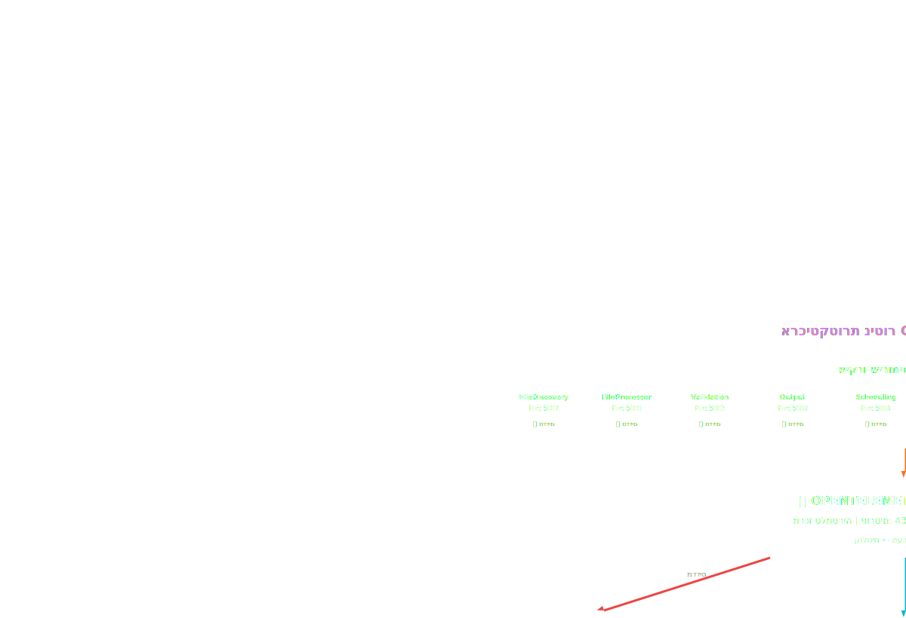

# מערך ניטור וצפייה
_מדדים • מעקבים • לוגים | שילוב OpenTelemetry מלא_

---

## Architecture Diagram (Embedded)

<svg viewbox="0 0 1200 820" xmlns="http://www.w3.org/2000/svg">
<defs>
<lineargradient id="otelGrad" x1="0%" x2="100%" y1="0%" y2="100%">
<stop offset="0%" style="stop-color:#f97316"></stop>
<stop offset="100%" style="stop-color:#ea580c"></stop>
</lineargradient>
<lineargradient id="promGrad" x1="0%" x2="100%" y1="0%" y2="100%">
<stop offset="0%" style="stop-color:#ef4444"></stop>
<stop offset="100%" style="stop-color:#dc2626"></stop>
</lineargradient>
<lineargradient id="grafanaGrad" x1="0%" x2="100%" y1="0%" y2="100%">
<stop offset="0%" style="stop-color:#f59e0b"></stop>
<stop offset="100%" style="stop-color:#d97706"></stop>
</lineargradient>
<lineargradient id="jaegerGrad" x1="0%" x2="100%" y1="0%" y2="100%">
<stop offset="0%" style="stop-color:#06b6d4"></stop>
<stop offset="100%" style="stop-color:#0891b2"></stop>
</lineargradient>
<lineargradient id="elasticGrad" x1="0%" x2="100%" y1="0%" y2="100%">
<stop offset="0%" style="stop-color:#10b981"></stop>
<stop offset="100%" style="stop-color:#059669"></stop>
</lineargradient>
<lineargradient id="fluentGrad" x1="0%" x2="100%" y1="0%" y2="100%">
<stop offset="0%" style="stop-color:#3b82f6"></stop>
<stop offset="100%" style="stop-color:#2563eb"></stop>
</lineargradient>
<lineargradient id="serviceGrad" x1="0%" x2="100%" y1="0%" y2="100%">
<stop offset="0%" style="stop-color:#8b5cf6"></stop>
<stop offset="100%" style="stop-color:#7c3aed"></stop>
</lineargradient>
<filter id="shadow">
<fedropshadow dx="0" dy="4" flood-opacity="0.4" stddeviation="6"></fedropshadow>
</filter>
<filter id="glow">
<fegaussianblur result="coloredBlur" stddeviation="4"></fegaussianblur>
<femerge>
<femergenode in="coloredBlur"></femergenode>
<femergenode in="SourceGraphic"></femergenode>
</femerge>
</filter>
<marker id="arrowOrange" markerheight="7" markerwidth="10" orient="auto" refx="9" refy="3.5">
<polygon fill="#f97316" points="0 0, 10 3.5, 0 7"></polygon>
</marker>
<marker id="arrowBlue" markerheight="7" markerwidth="10" orient="auto" refx="9" refy="3.5">
<polygon fill="#3b82f6" points="0 0, 10 3.5, 0 7"></polygon>
</marker>
<marker id="arrowRed" markerheight="7" markerwidth="10" orient="auto" refx="9" refy="3.5">
<polygon fill="#ef4444" points="0 0, 10 3.5, 0 7"></polygon>
</marker>
<marker id="arrowCyan" markerheight="7" markerwidth="10" orient="auto" refx="9" refy="3.5">
<polygon fill="#06b6d4" points="0 0, 10 3.5, 0 7"></polygon>
</marker>
<marker id="arrowGreen" markerheight="7" markerwidth="10" orient="auto" refx="9" refy="3.5">
<polygon fill="#10b981" points="0 0, 10 3.5, 0 7"></polygon>
</marker>
</defs>
<!-- Title -->
<text fill="#e879f9" font-size="18" font-weight="bold" text-anchor="middle" x="600" y="35">ארכיטקטורת ניטור OPENTELEMETRY</text>
<!-- MICROSERVICES LAYER -->
<rect fill="url(#serviceGrad)" filter="url(#shadow)" height="120" opacity="0.9" rx="12" width="1100" x="50" y="60"></rect>
<text fill="white" font-size="14" font-weight="bold" text-anchor="middle" x="600" y="85">מיקרו-שירותים (9 שירותים)</text>
<!-- Service boxes -->
<g>
<rect fill="rgba(255,255,255,0.15)" height="65" rx="6" stroke="rgba(255,255,255,0.3)" width="100" x="70" y="100"></rect>
<text fill="white" font-size="9" font-weight="bold" text-anchor="middle" x="120" y="120">FileDiscovery</text>
<text fill="rgba(255,255,255,0.7)" font-size="8" text-anchor="middle" x="120" y="135">Port 5007</text>
<text fill="#fbbf24" font-size="8" text-anchor="middle" x="120" y="155">📊 מדדים</text>
</g>
<g>
<rect fill="rgba(255,255,255,0.15)" height="65" rx="6" stroke="rgba(255,255,255,0.3)" width="100" x="180" y="100"></rect>
<text fill="white" font-size="9" font-weight="bold" text-anchor="middle" x="230" y="120">FileProcessor</text>
<text fill="rgba(255,255,255,0.7)" font-size="8" text-anchor="middle" x="230" y="135">Port 5008</text>
<text fill="#fbbf24" font-size="8" text-anchor="middle" x="230" y="155">📊 מדדים</text>
</g>
<g>
<rect fill="rgba(255,255,255,0.15)" height="65" rx="6" stroke="rgba(255,255,255,0.3)" width="100" x="290" y="100"></rect>
<text fill="white" font-size="9" font-weight="bold" text-anchor="middle" x="340" y="120">Validation</text>
<text fill="rgba(255,255,255,0.7)" font-size="8" text-anchor="middle" x="340" y="135">Port 5003</text>
<text fill="#fbbf24" font-size="8" text-anchor="middle" x="340" y="155">📊 מדדים</text>
</g>
<g>
<rect fill="rgba(255,255,255,0.15)" height="65" rx="6" stroke="rgba(255,255,255,0.3)" width="100" x="400" y="100"></rect>
<text fill="white" font-size="9" font-weight="bold" text-anchor="middle" x="450" y="120">Output</text>
<text fill="rgba(255,255,255,0.7)" font-size="8" text-anchor="middle" x="450" y="135">Port 5009</text>
<text fill="#fbbf24" font-size="8" text-anchor="middle" x="450" y="155">📊 מדדים</text>
</g>
<g>
<rect fill="rgba(255,255,255,0.15)" height="65" rx="6" stroke="rgba(255,255,255,0.3)" width="100" x="510" y="100"></rect>
<text fill="white" font-size="9" font-weight="bold" text-anchor="middle" x="560" y="120">Scheduling</text>
<text fill="rgba(255,255,255,0.7)" font-size="8" text-anchor="middle" x="560" y="135">Port 5004</text>
<text fill="#fbbf24" font-size="8" text-anchor="middle" x="560" y="155">📊 מדדים</text>
</g>
<g>
<rect fill="rgba(255,255,255,0.15)" height="65" rx="6" stroke="rgba(255,255,255,0.3)" width="100" x="620" y="100"></rect>
<text fill="white" font-size="9" font-weight="bold" text-anchor="middle" x="670" y="120">DataSource</text>
<text fill="rgba(255,255,255,0.7)" font-size="8" text-anchor="middle" x="670" y="135">Port 5001</text>
<text fill="#fbbf24" font-size="8" text-anchor="middle" x="670" y="155">📊 מדדים</text>
</g>
<g>
<rect fill="rgba(255,255,255,0.15)" height="65" rx="6" stroke="rgba(255,255,255,0.3)" width="100" x="730" y="100"></rect>
<text fill="white" font-size="9" font-weight="bold" text-anchor="middle" x="780" y="120">MetricsConfig</text>
<text fill="rgba(255,255,255,0.7)" font-size="8" text-anchor="middle" x="780" y="135">Port 5002</text>
<text fill="#fbbf24" font-size="8" text-anchor="middle" x="780" y="155">📊 מדדים</text>
</g>
<g>
<rect fill="rgba(255,255,255,0.15)" height="65" rx="6" stroke="rgba(255,255,255,0.3)" width="100" x="840" y="100"></rect>
<text fill="white" font-size="9" font-weight="bold" text-anchor="middle" x="890" y="120">InvalidRecords</text>
<text fill="rgba(255,255,255,0.7)" font-size="8" text-anchor="middle" x="890" y="135">Port 5006</text>
<text fill="#fbbf24" font-size="8" text-anchor="middle" x="890" y="155">📊 מדדים</text>
</g>
<g>
<rect fill="rgba(255,255,255,0.15)" height="65" rx="6" stroke="rgba(255,255,255,0.3)" width="100" x="950" y="100"></rect>
<text fill="white" font-size="9" font-weight="bold" text-anchor="middle" x="1000" y="120">Frontend</text>
<text fill="rgba(255,255,255,0.7)" font-size="8" text-anchor="middle" x="1000" y="135">Port 3000</text>
<text fill="#fbbf24" font-size="8" text-anchor="middle" x="1000" y="155">📊 מדדים</text>
</g>
<!-- Telemetry arrows -->
<path d="M 600 185 L 600 215" marker-end="url(#arrowOrange)" stroke="#f97316" stroke-width="3"></path>
<text fill="#fdba74" font-size="10" x="620" y="205">OTLP (gRPC/HTTP)</text>
<!-- OTEL COLLECTOR -->
<rect fill="url(#otelGrad)" filter="url(#shadow)" height="100" rx="12" width="500" x="350" y="225"></rect>
<text fill="white" font-size="16" font-weight="bold" text-anchor="middle" x="600" y="260">🔄 OPENTELEMETRY COLLECTOR</text>
<text fill="rgba(255,255,255,0.9)" font-size="12" text-anchor="middle" x="600" y="285">מרכז טלמטריה | פורטים: 4317 (gRPC) / 4318 (HTTP)</text>
<text fill="rgba(255,255,255,0.7)" font-size="11" text-anchor="middle" x="600" y="310">קולטים ← מעבדים ← מייצאים</text>
<!-- Arrows from OTEL to backends -->
<path d="M 420 330 L 200 400" marker-end="url(#arrowRed)" stroke="#ef4444" stroke-width="3"></path>
<path d="M 600 330 L 600 400" marker-end="url(#arrowCyan)" stroke="#06b6d4" stroke-width="3"></path>
<path d="M 780 330 L 1000 400" marker-end="url(#arrowGreen)" stroke="#10b981" stroke-width="3"></path>
<!-- Labels on arrows -->
<text fill="#fca5a5" font-size="10" x="310" y="355">מדדים</text>
<text fill="#67e8f9" font-size="10" x="620" y="370">מעקבים</text>
<text fill="#6ee7b7" font-size="10" x="860" y="355">לוגים</text>
<!-- PROMETHEUS (Dual) -->
<rect fill="url(#promGrad)" filter="url(#shadow)" height="160" rx="12" width="300" x="50" y="410"></rect>
<text fill="white" font-size="14" font-weight="bold" text-anchor="middle" x="200" y="440">📈 PROMETHEUS (מופע כפול)</text>
<!-- System Prometheus -->
<rect fill="rgba(255,255,255,0.15)" height="100" rx="8" stroke="rgba(255,255,255,0.3)" width="125" x="70" y="455"></rect>
<text fill="white" font-size="11" font-weight="bold" text-anchor="middle" x="132" y="480">מערכת</text>
<text fill="rgba(255,255,255,0.8)" font-size="10" text-anchor="middle" x="132" y="498">Port: 9090</text>
<line stroke="rgba(255,255,255,0.3)" x1="85" x2="180" y1="510" y2="510"></line>
<text fill="rgba(255,255,255,0.7)" font-size="9" text-anchor="middle" x="132" y="528">תשתית</text>
<text fill="rgba(255,255,255,0.7)" font-size="9" text-anchor="middle" x="132" y="543">מדדי K8s</text>
<!-- Business Prometheus -->
<rect fill="rgba(255,255,255,0.15)" height="100" rx="8" stroke="rgba(255,255,255,0.3)" width="125" x="205" y="455"></rect>
<text fill="white" font-size="11" font-weight="bold" text-anchor="middle" x="267" y="480">עסקי</text>
<text fill="rgba(255,255,255,0.8)" font-size="10" text-anchor="middle" x="267" y="498">Port: 9091</text>
<line stroke="rgba(255,255,255,0.3)" x1="220" x2="315" y1="510" y2="510"></line>
<text fill="rgba(255,255,255,0.7)" font-size="9" text-anchor="middle" x="267" y="528">KPIs עסקיים</text>
<text fill="rgba(255,255,255,0.7)" font-size="9" text-anchor="middle" x="267" y="543">מדדים מותאמים</text>
<!-- JAEGER -->
<rect fill="url(#jaegerGrad)" filter="url(#shadow)" height="160" rx="12" width="300" x="450" y="410"></rect>
<text fill="white" font-size="14" font-weight="bold" text-anchor="middle" x="600" y="440">🔍 JAEGER</text>
<text fill="rgba(255,255,255,0.8)" font-size="11" text-anchor="middle" x="600" y="460">מעקב מבוזר</text>
<rect fill="rgba(255,255,255,0.15)" height="80" rx="8" stroke="rgba(255,255,255,0.3)" width="260" x="470" y="475"></rect>
<text fill="white" font-size="11" text-anchor="middle" x="600" y="500">UI Port: 16686</text>
<text fill="rgba(255,255,255,0.8)" font-size="10" text-anchor="middle" x="600" y="520">Collector: 4317</text>
<line stroke="rgba(255,255,255,0.3)" x1="490" x2="710" y1="532" y2="532"></line>
<text fill="rgba(255,255,255,0.7)" font-size="9" text-anchor="middle" x="600" y="548">ניתוח Spans | מפות שירות | היסטוגרמות השהייה</text>
<!-- ELASTICSEARCH -->
<rect fill="url(#elasticGrad)" filter="url(#shadow)" height="160" rx="12" width="300" x="850" y="410"></rect>
<text fill="white" font-size="14" font-weight="bold" text-anchor="middle" x="1000" y="440">🔎 ELASTICSEARCH</text>
<text fill="rgba(255,255,255,0.8)" font-size="11" text-anchor="middle" x="1000" y="460">לוגים מרכזיים</text>
<rect fill="rgba(255,255,255,0.15)" height="80" rx="8" stroke="rgba(255,255,255,0.3)" width="260" x="870" y="475"></rect>
<text fill="white" font-size="11" text-anchor="middle" x="1000" y="500">Port: 9200</text>
<line stroke="rgba(255,255,255,0.3)" x1="890" x2="1110" y1="515" y2="515"></line>
<text fill="rgba(255,255,255,0.7)" font-size="9" text-anchor="middle" x="1000" y="533">אינדקס לוגים</text>
<text fill="rgba(255,255,255,0.7)" font-size="9" text-anchor="middle" x="1000" y="548">Backend ל-Jaeger Spans</text>
<!-- FLUENT BIT -->
<rect fill="url(#fluentGrad)" filter="url(#shadow)" height="70" rx="10" width="300" x="850" y="620"></rect>
<text fill="white" font-size="13" font-weight="bold" text-anchor="middle" x="1000" y="650">📝 FLUENT BIT (DaemonSet)</text>
<text fill="rgba(255,255,255,0.8)" font-size="10" text-anchor="middle" x="1000" y="675">לוגי קונטיינרים | העשרת K8s | פירסור JSON</text>
<!-- Arrow from Fluent Bit to Elasticsearch (pointing UP) -->
<path d="M 1000 620 L 1000 575" marker-end="url(#arrowGreen)" stroke="#3b82f6" stroke-width="2"></path>
<!-- GRAFANA -->
<rect fill="url(#grafanaGrad)" filter="url(#shadow)" height="130" rx="12" width="500" x="250" y="620"></rect>
<text fill="white" font-size="16" font-weight="bold" text-anchor="middle" x="500" y="650">📊 GRAFANA</text>
<text fill="rgba(255,255,255,0.9)" font-size="12" text-anchor="middle" x="500" y="675">ויזואליזציה ולוחות בקרה | Port: 3001</text>
<!-- Dashboard boxes - evenly distributed across GRAFANA width (250-750) -->
<rect fill="rgba(255,255,255,0.2)" height="45" rx="6" width="120" x="280" y="690"></rect>
<text fill="white" font-size="10" font-weight="bold" text-anchor="middle" x="340" y="708">עסקי</text>
<text fill="rgba(255,255,255,0.8)" font-size="9" text-anchor="middle" x="340" y="725">Business</text>
<rect fill="rgba(255,255,255,0.2)" height="45" rx="6" width="120" x="440" y="690"></rect>
<text fill="white" font-size="10" font-weight="bold" text-anchor="middle" x="500" y="708">תשתית</text>
<text fill="rgba(255,255,255,0.8)" font-size="9" text-anchor="middle" x="500" y="725">Health</text>
<rect fill="rgba(255,255,255,0.2)" height="45" rx="6" width="120" x="600" y="690"></rect>
<text fill="white" font-size="10" font-weight="bold" text-anchor="middle" x="660" y="708">תורים</text>
<text fill="rgba(255,255,255,0.8)" font-size="9" text-anchor="middle" x="660" y="725">RabbitMQ</text>
<!-- Arrows from Prometheus to Grafana -->
<path d="M 200 575 L 350 620" stroke="#f59e0b" stroke-dasharray="5,3" stroke-width="2"></path>
<path d="M 600 575 L 500 620" stroke="#f59e0b" stroke-dasharray="5,3" stroke-width="2"></path>
<!-- Business Metrics Box -->
<rect fill="rgba(239,68,68,0.2)" height="130" rx="10" stroke="rgba(239,68,68,0.4)" width="180" x="50" y="620"></rect>
<text fill="#fca5a5" font-size="11" font-weight="bold" text-anchor="middle" x="140" y="645">מדדים עסקיים</text>
<text fill="#fca5a5" font-size="8" text-anchor="middle" x="140" y="667">records_processed_total •</text>
<text fill="#fca5a5" font-size="8" text-anchor="middle" x="140" y="683">invalid_records_total •</text>
<text fill="#fca5a5" font-size="8" text-anchor="middle" x="140" y="699">files_processed_total •</text>
<text fill="#fca5a5" font-size="8" text-anchor="middle" x="140" y="715">processing_duration •</text>
<text fill="#fca5a5" font-size="8" text-anchor="middle" x="140" y="731">end_to_end_latency •</text>
<!-- Legend - all labels evenly distributed across box -->
<rect fill="rgba(255,255,255,0.05)" height="35" rx="8" width="1100" x="50" y="770"></rect>
<text fill="#f97316" font-size="10" text-anchor="middle" x="120" y="792">OTEL Collector</text>
<text fill="#ef4444" font-size="10" text-anchor="middle" x="280" y="792">Prometheus</text>
<text fill="#06b6d4" font-size="10" text-anchor="middle" x="440" y="792">Jaeger</text>
<text fill="#10b981" font-size="10" text-anchor="middle" x="600" y="792">Elasticsearch</text>
<text fill="#3b82f6" font-size="10" text-anchor="middle" x="760" y="792">Fluent Bit</text>
<text fill="#f59e0b" font-size="10" text-anchor="middle" x="920" y="792">Grafana</text>
<text fill="#c4b5fd" font-size="10" text-anchor="middle" x="1060" y="792">ez-platform</text>
</svg>

## Related Documentation

- [כל הדיאגרמות ←](./index.md)
- [סקירת ארכיטקטורה ←](./architecture-overview.md)
- [צינור נתונים ←](./data-pipeline.md)

---

_Generated from observability.html_
_Date: 1766658851.1378593_
